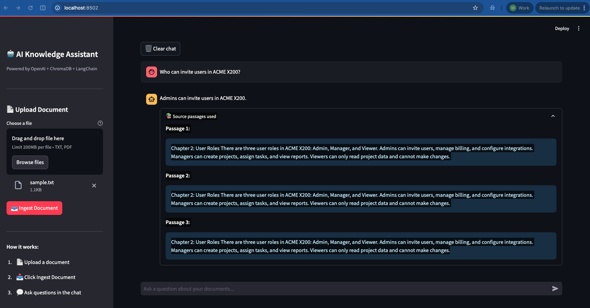

# 🤖 AI Knowledge Assistant

An enterprise-grade RAG (Retrieval-Augmented Generation) chatbot that answers questions from your uploaded documents — instantly and accurately.



## What it does

Upload any document — sales playbooks, product manuals, contracts, onboarding guides — and ask questions in plain English. The assistant finds the relevant information and generates accurate answers, showing exactly which passages it used.

## Why this matters

Traditional search finds keywords. This finds **meaning**. Ask "what are the consequences of late payment?" and it finds the relevant clause even if those exact words don't appear in the document.

## Tech Stack

| Layer | Tool | Why |
|---|---|---|
| LLM | OpenAI GPT-4o-mini | Fast, accurate, cost-effective |
| Embeddings | OpenAI Embeddings | Converts text to meaning |
| Orchestration | LangChain | Connects all the pieces |
| Vector Database | ChromaDB | Stores and searches embeddings |
| Frontend | Streamlit | Clean, fast Python web UI |
| Language | Python 3.13 | Industry standard for AI/ML |

## Architecture
Documents → Chunker → Embedder → ChromaDB
↓
User Question → Embedder → Vector Search → LLM → Answer

## Features

- 📄 Upload TXT and PDF documents
- 🔍 Semantic search — finds meaning, not just keywords
- 💬 Conversational chat interface
- 📚 Shows source passages used to generate each answer
- 🔒 Answers only from your documents — no hallucination

## Live Demo

🚀 **[Try it live here](https://matt-ai-knowledge-assistant.streamlit.app)**

Upload a document and start asking questions instantly — no setup required.
## Getting Started

### Prerequisites
- Python 3.10+
- OpenAI API key

### Installation

```bash
git clone https://github.com/matt-ai-projects/ai-knowledge-assistant.git
cd ai-knowledge-assistant
python3 -m venv .venv
source .venv/bin/activate
pip install -r requirements.txt
```

### Configuration

Create a `.env` file in the root directory:
OPENAI_API_KEY=your_openai_api_key_here

### Run

```bash
streamlit run app.py
```

Then open your browser at `http://localhost:8501`

## Usage

1. Upload a document using the sidebar
2. Click **Ingest Document** to index it
3. Ask questions in the chat box
4. Expand **Source passages used** to see exactly where the answer came from

## Project Structure
ai-knowledge-assistant/
├── app.py                  # Streamlit chatbot UI
├── requirements.txt        # Python dependencies
├── assets/                 # Screenshots and images
├── docs/                   # Document storage
└── src/
└── rag/
├── ingest.py       # Document loading and chunking
├── retriever.py    # Vector search
└── chain.py        # LLM and RAG pipeline

## Author

Built by Matthew Clarke as a portfolio project demonstrating enterprise RAG architecture.